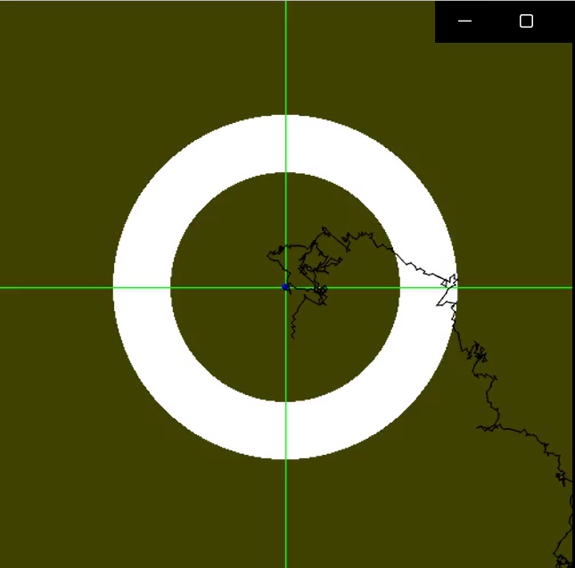

# Omnisafe-decisiondiffuser

#这个repo是基于omnisafe框架进行重新开发的，
使用omnisafe框架实现了DecisionDiffuser算法的复现。
我单独开发了一个新环境SafetyDrawCircle用于实验。该环境开发过程中与omnisafe进行了对齐。
由于DD算法是一个offline算法，因此我基于SafetyDrawCircle创建了一个数据集用于算法的训练。
受制于机器性能，我只能对DD算法在论文中展示的条件生成和技能融合能力进行了简单的复现。

# 环境与数据集的详细信息

## 环境

SafetyDrawCircle是一个2D平面动点环境，
红色的点表示当前时刻的智能体，在每一时刻他的状态由位置，速度和加速度构成。
Reward等于智能体当前速度的模。
Cost由智能体当前位置是否处于约束范围内（白色区域）决定。
SafetyDrawCircle支持两种动作值控制方式：速度控制和加速度控制，我在复现实验中使用的是速度控制。
环境的可视化是通过Pygame实现的。调用render函数时会返回当前帧的RGB数值矩阵(np.array)。

## 数据集

为了训练DD算法，我构建了一个简易数据集，该数据集由2000条具有1000个step的轨迹组成，
生成数据集的方式如下：
首先进行一次概率随机指定轨迹的类型：圆形轨迹或矩形轨迹。
然后从均匀分布中采样出轨迹的运动半径。
最后从均匀分布中采样出轨迹的运动角速度。

轨迹类型代表DD算法中的skill概念，即对应进行圆周运动的skill和方形运动的skill。
轨迹半径用于控制轨迹是否满足约束条件，即轨迹是否分布在允许的运动范围内。
轨迹角速度用于生成不同奖励分布的轨迹。

# 训练

## 优化改进

论文中的方法在预测过程中，每次动作决策时都需要执行diffusionModel，diffusion是一个十分费时的过程，
以我的机器为例（GTX1070），执行一轮100次diffusion的耗时大约为1s，这使得一条1000个step轨迹生成需要耗时数十分钟，
这显然是低效的。
动作值决策过程中，输入一个size=HorizonLength*StateDim的矩阵给diffusion模块，
矩阵的每一行表示一个state，前C行赋值为从当前时刻起的前C个历史状态，然后输出一个同尺寸的矩阵，如下图所示。

在这个设定下，每次动作决策都需要调用一次diffusion模型，而且输出矩阵所预测的后续state值只使用了当前state的后一项St+1，
后续的{St+2,St+3,...}都被舍弃了。
而事实上，Diffusermodel的作用是生成一条符合约束条件（或技能）的state序列，
也就是说，diffusermodel输出的矩阵实际上预测了多个后续状态，
基于此，我改进了动作值的决策方式，如下图所示：

1.调用一次diffusermodel基于当前长度为C的历史状态序列预测出后续状态{pre:St+1,St+2,...}，
2.调用逆动力学模型AVRmodel根据t时刻的真实状态St和t+1时刻预测状态{pre:St+1}得到动作值At，
3.执行At得到t+1时刻的真实状态{True:St+1},
4.复用步骤1中得到的预测序列，使用{pre:St+2}与{True:St+1}输出到AVRmodel得到t+1时刻的动作值At+1.
5.循环执行步骤3和步骤4 K次。

使用这个决策流程可以实现每调用1次diffusermodel而生成K个动作值，这样可以大大提高模型的决策效率。
需要注意的是，步骤1中得到的预测序列{pre:St+1,St+2,...}是理想预测序列，而由于逆动力学模型是用神经网络拟合的，
因此受制于逆动力学模型的拟合性能，在{True:St}下执行At得到的{True:St+1}可能与{Pre:St+1}存在误差，
执行多步循环后，误差会累积，因此循环次数K过大会影响模型性能。

## Parameters Config

# 实验

## 实验环境

实验环境可视化如下图所示:

整个可视平面坐标(x,y)范围是<-1,1>,

【红点】表示agent当前位置坐标，白色部分由两个同心圆组合而成，内环半径为0.4，外环半径为0.6

rewards:agent当前时刻的运动速度的模作为奖励值，即运动越快奖励值越高。

cost:白色区域是”安全范围"，这要求agent在白色区域内运动才满足约束条件。
训练时，若当前位置在白色圆环范围内，则cost等于0，否则为1。

skills:实验中采用了使用轨迹形状表示“技能”，我在数据集中引入了两种“技能”：圆周轨迹和矩形轨迹。
下图展示了不同半径的圆形和矩形运动轨迹。
训练时，若运动轨迹为圆周，则“技能标识向量”赋值为[1,0]，
若运动轨迹为矩形，则“技能标识向量“赋值为[0,1]。

## 数据集详情

一条完整的数据构成如下：

{Traj:[<S_0,A_0,R_0,S_1,Cost_0>,<S_1,A_1,R_1,S_2,Cost_1>...<S_999,A_999,R_999,S_1000,Cost_999>],
Constraints:0.3,
Skills:[1,0]}

数据由三部分构成，首先是Traj，这部分包含了Safety RL所需要的轨迹数据，分别是当前状态，动作值，奖励值，下一时刻状态Cost，
其中reward的计算方式为速度的模，cost计算方式是如当前状态处于白色环形范围内则为0，否则为1。
第二部分是约束条件Constraints，0.3表示该轨迹有30%的点在白色圆环内。
第三部分是轨迹技能Skills，在数据集中仅有两种可能的取值{[0,1],[1,0]},[0,1]表示该轨迹为圆周运动轨迹，[1,0]表示该轨迹为矩形运动轨迹。

在随机生成一条轨迹时，会指定该轨迹的运行半径，运动角速度和轨迹类型（即skill）。
运动半径影响了轨迹的reward，cost和constraints，
运动角速度影响了轨迹的reward，
轨迹类型影响了skill。

## 实验结果

### 1 Constraints

Constraints由轨迹在环形范围内的比例决定，Constraints的范围为[0,1],0表示轨迹均分布在圆环范围内，1表示轨迹分布在圆环范围外。

生成轨迹时设定Constraints条件为0时，轨迹将朝着白色圆环内移动。

生成轨迹时设定Constraints条件为1时，轨迹将朝着白色圆环外移动。

### 2 skills融合

在训练数据集中没有skill标识为[1,1]的轨迹，使用模型生成skill标识为[1,1]的轨迹如下：

从图中可以看出，轨迹同时表现了出了圆周和矩形两种特征。

### 3 History observation Length

HistoryObservationLength(HOL)决定了模型生成时输入的历史观测序列长度，
由于这个参数会在训练时的diffusion过程中会改变输入，因此用特定HOL参数训练得到的模型在进行evaluate时不可以进行更改。

上图分别是HOL=16和HOL=1训练80个epoch(160000step)时以skill=[1,0]（圆形轨迹）生成的轨迹。
可以看出HOL16生成了无效的轨迹，这说明此参数过大会让模型难以训练。

### 4 Multi-step-predict

Multi-step-predict(MSP)决定每次采样后直接根据采样轨迹预测动作值的步数。
这个参数仅在evaluate时发挥作用，因此可以在使用不同模型预测时进行更改。

上图分别是MSP=50与MSP=20的的轨迹生成表现。
MSP50生成的圆周轨迹半径变化很大，而MSP20生成的轨迹半径变化小，这说明MSP20对数据集轨迹的拟合性能更佳，
这是因为多步预测十分依赖于动力学模型对环境的拟合效果，随着MSP的增大，由ActionInvModel带来的误差会逐渐累积，导致轨迹变形。
因此MSP的增大虽然可以缩短轨迹的生成时间，但是会影响生成质量。

尤其当环境的DynamicModel过于复杂时，多步预测的误差将变得很大，MSP的选取应当保守。
（实验中的环境DynamicModel是一个速度-位移关系，比较容易拟合。）

